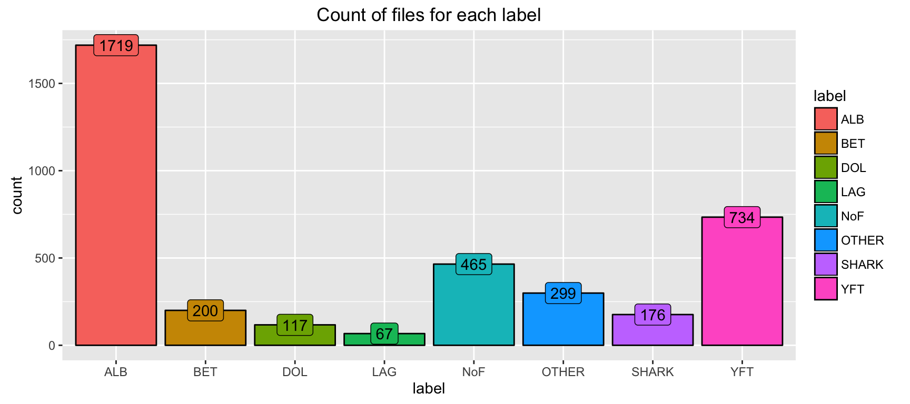

# Explore the logloss function
Jordan Trémoureux  
November 30, 2016  


```r
# Loading packages
pkgs = c("ggplot2", "data.table","DT")
inst = lapply(pkgs, library, character.only = TRUE)
```

----------

# Goal
My goal here is to describe the [multi-class logarithmic loss](https://www.kaggle.com/c/the-nature-conservancy-fisheries-monitoring/details/evaluation) (aka. logloss) function that is used to evaluate the submissions.  

# The loggloss function

## What is this function ?

$$\text{logloss} = -\dfrac{1}{N} \sum_{i=1}^{N} \sum_{j=1}^{M} y_{ij} \log(p_{ij})$$
  
- $N$ is the number of image in the test set, so $N=1000$.  
- $i$ is an image in the test set.  
- $M$ is the number of image class labels, so $M=8$ because class labels are :

```r
labels <- c('ALB'=1, 'BET'=2, 'DOL'=3, 'LAG'=4, 'NoF'=5, 'OTHER'=6, 'SHARK'=7,'YFT'=8)
lab <- c('ALB', 'BET', 'DOL', 'LAG', 'NoF', 'OTHER', 'SHARK','YFT')
```
- $j$ is one class label.  
- $\log$ is the natural logarithm  
  
- $y_{ij} = 1$ if the image $i$ belongs to the class $j$, and $y_{ij} = 0$ otherwise.    
- $p_{i} \in [0,1]^8$ are your 8 probabilities $p_{ij}$ for the image $i$. With $p_{ij}$ the probability that the image $i$ belongs to the class $j$.  

For example, if your submission looks like this :


```r
pred <- data.frame(image = c("img_00001.jpg", "img_00002.jpg"),
                   ALB = c(1, 0.6), BET = c(0, 0.2), DOL = c(0,1.2), LAG = c(0,0),
                   NoF = c(0,0), OTHER = c(0,0), SHARK = c(0,0), YFT = c(0,0))
pred
```

```
#>           image ALB BET DOL LAG NoF OTHER SHARK YFT
#> 1 img_00001.jpg 1.0 0.0 0.0   0   0     0     0   0
#> 2 img_00002.jpg 0.6 0.2 1.2   0   0     0     0   0
```

This means :  
- $p_{11} = 1$, $p_{12} = 0$, ..., $p_{18} = 0$   
- $p_{21} = 0.6$, $p_{22} = 0.2$, $p_{23} = 1.2$, $p_{24} = 0$, ..., $p_{28} = 0$   
- ...

## Some warnings 

Wait!! Some of your probabilities are $> 1$!  

You're right but, in fact, *the submitted probabilities for a given image are not required to sum to one because they are rescaled prior to being scored (each row is divided by the row sum).*  

Then those probabilities became :

```r
lab <- 2:9
pred[,lab] <- data.frame(t(apply(pred[,lab], 1, function(x) x/sum(x))))
```

Wait!! Some probabilities are equal to 0, and $\log (0)$...

You're right but, in fact, *In order to avoid the extremes of the log function, predicted probabilities are replaced with*
$$
\max(\min(p,1−10^{−15}),10^{−15})
$$


```r
maxmin <- function(predicted, eps=1e-15) {
  return(max(min(predicted, 1-eps), eps))
}
```

That's why, this submission will be transformed to :

```r
pred2 <- pred
lab = 2:9
pred2[,lab] <- data.frame(t(apply(pred2[,lab], 1, function(x) sapply(x, maxmin))))
pred2
```

```
#>           image ALB   BET   DOL   LAG   NoF OTHER SHARK   YFT
#> 1 img_00001.jpg 1.0 1e-15 1e-15 1e-15 1e-15 1e-15 1e-15 1e-15
#> 2 img_00002.jpg 0.3 1e-01 6e-01 1e-15 1e-15 1e-15 1e-15 1e-15
```

This means :  
- $p_{11} = 1-10^{-15}, p_{12} = 10^{-15}, ..., p_{18} = 10^{-15}$  
- $p_{21} = 0.3, p_{22} = 0.1, p_{23} = 0.6, p_{24} = 10^{-15}, ..., p_{28} = 10^{-15}$  
- ...

Wait!! With this transformation, the sum $\sum_{j=1}^{9} p_{ij} \neq 1$!  
Yes you're right.

```r
apply(pred2[,lab], 1, sum) == c(1, 1)
```

```
#> [1] FALSE FALSE
```

In fact this is pretty close, and I think this will not change anything. Or maybe the probabilities are rescale a second time.


# Some classifiers
## The perfect classifier - Score = 0

Let's see the images in the test set 

```r
set.seed(123)
test_folder <- '../../input/test_stg1'
n_test <- length(list.files(test_folder))
n_test
```

```
#> [1] 1000
```
There is 1000 images in the test data set.

So what is the score of the perfect classifier ?   
The best classifier will predict $p_{ij}=1$ when the image $i$ belongs to the class $j$, ie when $y_{ij}=1$, and 0 otherwise (when)  
$$
\text{logloss} = -\dfrac{1}{100} \sum_{i=1}^{100} 1 \times \log(1) = 0
$$
That's why, the more you are closed to 0, the best rank you have in the [leaderboard](https://www.kaggle.com/c/the-nature-conservancy-fisheries-monitoring/leaderboard).

<small>
In fact, getting exactly 0 is impossible, because probabilities can't be equal to 1.  
The best score you can have should be something like $-\dfrac{1}{100} \sum_{i=1}^{100} 1 \times \log(1-10^{-15}) = -\log(1-10^{-15}) \simeq + 9.992007 10^{-16} \simeq 0$  
</small>

## A very naive classifier - Score = 2.07944
Since there are 8 class labels, why not just set all probabilities to $\dfrac{1}{8}$?  
This seems fun to me, let's do this!


```r
subm0 <- data.table(image = list.files(test_folder),
                ALB = 1/8, BET = 1/8, DOL = 1/8, LAG = 1/8,
                NoF = 1/8, OTHER = 1/8, SHARK = 1/8, YFT = 1/8)
write.csv(subm0, file = "../../output/subm0.csv", row.names = FALSE)
# Your submission scored 2.07944, 448/486.. not really good
```


## A less naive classifier - Score = 1.64611
Maybe $\dfrac{1}{8}$ for everyone is too naive. Let's see how is our training data set.


```r
set.seed(123)
train_folder <- '../../input/train'
print(list.files(train_folder))
```

```
#> [1] "ALB"   "BET"   "DOL"   "LAG"   "NoF"   "OTHER" "SHARK" "YFT"
```

```r
tmp <- lapply(list.files(train_folder), function(x) list.files(paste0(train_folder, '/', x)))
train_files <- data.table(label = rep(list.files(train_folder), sapply(tmp, length)),
             image = unlist(tmp))
train_files
```

```
#>       label         image
#>    1:   ALB img_00003.jpg
#>    2:   ALB img_00010.jpg
#>    3:   ALB img_00012.jpg
#>    4:   ALB img_00015.jpg
#>    5:   ALB img_00019.jpg
#>   ---                    
#> 3773:   YFT img_07853.jpg
#> 3774:   YFT img_07854.jpg
#> 3775:   YFT img_07891.jpg
#> 3776:   YFT img_07901.jpg
#> 3777:   YFT img_07911.jpg
```


```r
n_train <- nrow(train_files) # 3777

ggplot(train_files, aes(x=label, fill=label)) + 
      geom_bar(colour="black") +
      geom_label(stat='count', aes(label=..count..), show.legend = FALSE) +
      ggtitle("Count of files for each label")
```



There are a lot more of **ALB** (1719, Albacore tuna) in the dataset than the others. There are few **LAG** (67, Opah).   
What we can do, is to set the probabilities to the frequency of each class label in the dataset.


```r
label_DT <- train_files[, .N, label][, freq:=N/n_train]
setkey(label_DT, label)
label_DT
```

```
#>    label    N       freq
#> 1:   ALB 1719 0.45512311
#> 2:   BET  200 0.05295208
#> 3:   DOL  117 0.03097697
#> 4:   LAG   67 0.01773895
#> 5:   NoF  465 0.12311358
#> 6: OTHER  299 0.07916336
#> 7: SHARK  176 0.04659783
#> 8:   YFT  734 0.19433413
```


```r
subm1 <- data.table(image = list.files(test_folder),
                ALB = label_DT["ALB",freq], BET = label_DT["BET",freq], DOL = label_DT["DOL",freq], LAG = label_DT["LAG",freq],
                NoF = label_DT["NoF",freq], OTHER = label_DT["OTHER",freq], SHARK = label_DT["SHARK",freq], YFT = label_DT["YFT",freq])
write.csv(subm1, file = "../../output/subm1.csv", row.names = FALSE)

# Your submission scored 1.64611
```

In fact, this solution really looks like the Sample Submission Benchmark in the file *sample_submission_stg1.csv*.

## The benchmark classifier - Score = 1.61364

```r
subm <- data.table(read.csv("../../input/sample_submission_stg1.csv"))
subm[1,lab,with=F]
```

```
#>          ALB        BET        DOL        LAG      NoF     OTHER
#> 1: 0.4550026 0.05293806 0.03096877 0.01773425 0.123081 0.0791424
#>         SHARK       YFT
#> 1: 0.04658549 0.1942827
```

```r
subm1[1,lab,with=F]
```

```
#>          ALB        BET        DOL        LAG       NoF      OTHER
#> 1: 0.4551231 0.05295208 0.03097697 0.01773895 0.1231136 0.07916336
#>         SHARK       YFT
#> 1: 0.04659783 0.1943341
```

This benchmark can be find in the [leaderboard](https://www.kaggle.com/c/the-nature-conservancy-fisheries-monitoring/leaderboard), with a score of 1.61364.   

I don't know why the benchmark is not *subm1*.. Does anyone know ?  
Maybe in the benchmark, the probabilities are the frequencies in the test set ? :D.

## A real classifier : Fishy Keras #1 - Score = 1.29546

Thanks to the popular kernel [Fishy Keras [LB: 1.25267]](https://www.kaggle.com/zfturbo/the-nature-conservancy-fisheries-monitoring/fishy-keras-lb-1-25267) by [ZFTurbo](https://www.kaggle.com/zfturbo) you can get the [output](https://www.kaggle.com/zfturbo/the-nature-conservancy-fisheries-monitoring/fishy-keras-lb-1-25267/output) for a real classifier.


```r
fileUrl2 <- "https://www.kaggle.io/svf/445238/40dacb2a0eb96787be3e4373d253071e/submission_loss_loss_0.779022299035_folds_3_ep_30_folds_3_2016-11-14-15-31.csv"
download.file(fileUrl2, method = "curl", destfile = "../../output/subm2.csv")
subm2 <- data.table(read.csv("../../output/subm2.csv"))
#write.csv(subm2, file = "../../output/subm2.csv", row.names = FALSE)
#datatable(subm2)
subm2
```

```
#>               ALB          BET          DOL          LAG         NoF
#>    1: 0.001020736 0.0008271631 2.282018e-05 4.850860e-06 0.997879922
#>    2: 0.442537695 0.0782792568 3.692789e-02 4.096681e-02 0.094439171
#>    3: 0.669017792 0.0443414636 1.402793e-02 1.691044e-02 0.051816642
#>    4: 0.572214603 0.0475729890 2.082669e-02 1.375560e-02 0.103962503
#>    5: 0.445207804 0.0623388104 3.522800e-02 2.011349e-02 0.086815715
#>   ---                                                               
#>  996: 0.531719625 0.0546972752 2.940337e-02 2.012618e-02 0.078593932
#>  997: 0.232312083 0.0638024732 1.603678e-01 1.634542e-02 0.202655911
#>  998: 0.837766647 0.0261841118 4.093315e-03 4.401042e-03 0.037460227
#>  999: 0.976229489 0.0023589674 2.327763e-04 1.464512e-04 0.005664347
#> 1000: 0.452013761 0.0466434769 2.136233e-02 1.125107e-02 0.227435097
#>              OTHER        SHARK          YFT         image
#>    1: 2.179861e-05 8.409765e-07 0.0002218342 img_00005.jpg
#>    2: 1.324217e-01 3.874933e-02 0.1356781274 img_00007.jpg
#>    3: 1.268977e-01 2.043688e-02 0.0565511398 img_00009.jpg
#>    4: 9.894014e-02 3.249028e-02 0.1102372408 img_00018.jpg
#>    5: 1.529752e-01 6.007597e-02 0.1372450143 img_00027.jpg
#>   ---                                                     
#>  996: 1.385550e-01 3.712417e-02 0.1097804382 img_07905.jpg
#>  997: 6.652834e-02 3.057725e-02 0.2274108082 img_07906.jpg
#>  998: 2.563967e-02 5.565637e-03 0.0588893592 img_07908.jpg
#>  999: 4.967495e-04 6.089267e-05 0.0148103265 img_07910.jpg
#> 1000: 1.113959e-01 2.489911e-02 0.1049992144 img_07921.jpg
```

```r
# Your submission scored 1.29546
```

## A real classifier : Fishy Keras #2 - Score = 1.14379

[pankajsharma](https://www.kaggle.com/pankajvshrma) and his team **The Proud Team**, improved the Fishy Keras classifier.


```r
fileUrl3 <- "https://www.kaggle.io/svf/464662/c3db400681ddd755421841d4f08dfa15/submission_loss_loss_0.61935684931_folds_3_ep_15_fl_96_folds_3_2016-11-24-10-39.csv"
download.file(fileUrl3, method = "curl", destfile = "../../output/subm3.csv")
subm3 <- data.table(read.csv("../../output/subm3.csv"))

# Your submission scored 1.14379
```

## Aggregate two classifier ? #1 Score = ?


```r
boost1 <- 0.9*subm2[,lab,with=F] + 0.1*subm1[,lab,with=F]
```

```
#> Warning in Ops.factor(left, right): '*' not meaningful for factors
```

```r
boost1$image <- subm2$image
write.csv(boost1, file = "../../output/boost1.csv", row.names = FALSE)

# Your submission scored ?
```

## Aggregate two classifier ? #2 Score = 1.15792


```r
boost2 <- 0.9*subm3[,lab,with=F] + 0.1*subm1[,lab,with=F]
```

```
#> Warning in Ops.factor(left, right): '*' not meaningful for factors
```

```r
boost2$image <- subm3$image
write.csv(boost2, file = "../../output/boost2.csv", row.names = FALSE)

# Your submission scored 1.15792
```


## Aggregate two classifier ? #3 Score = ?


```r
boost3 <- 0.6*subm3[,lab,with=F] + 0.4*subm2[,lab,with=F]
```

```
#> Warning in Ops.factor(left, right): '*' not meaningful for factors

#> Warning in Ops.factor(left, right): '*' not meaningful for factors
```

```r
boost3$image <- subm3$image
write.csv(boost3, file = "../../output/boost3.csv", row.names = FALSE)

# Your submission scored 1.15792
```


